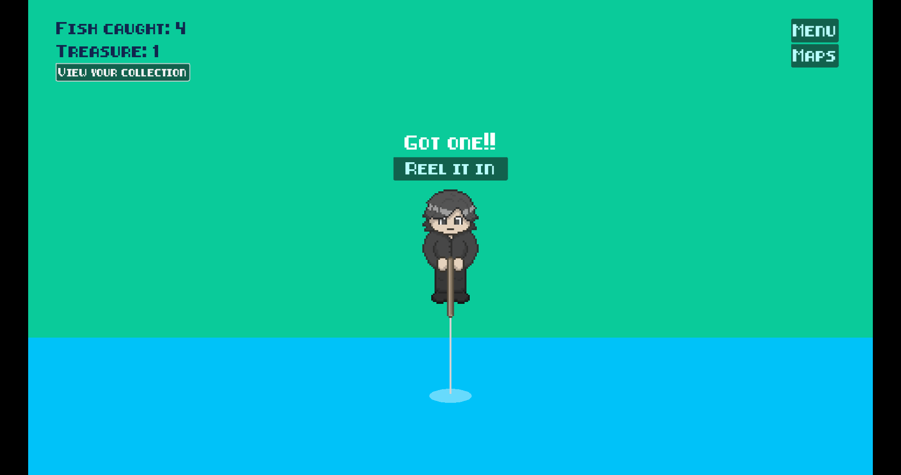
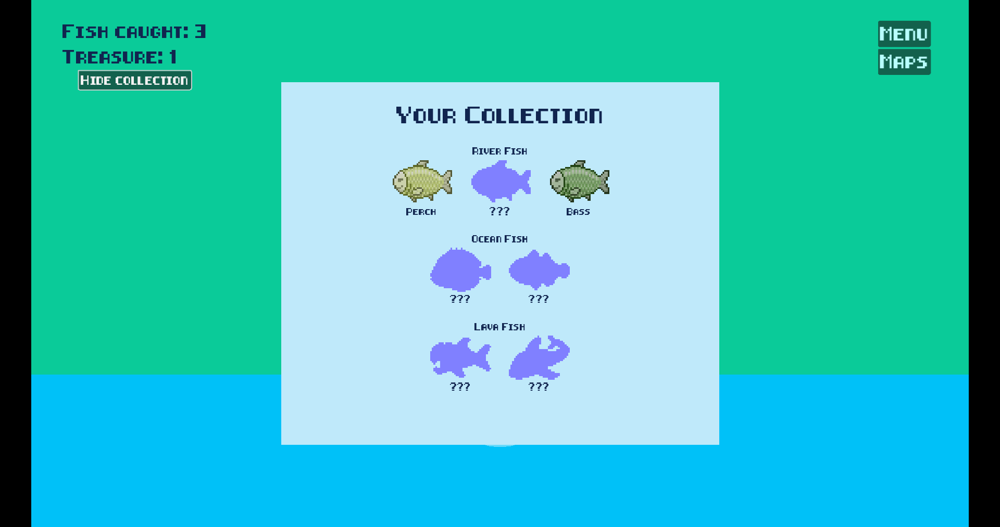
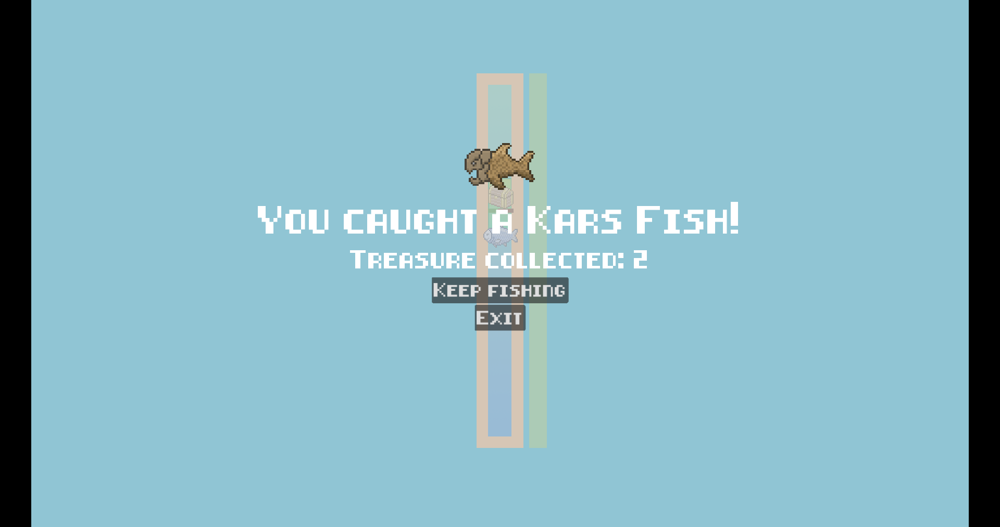
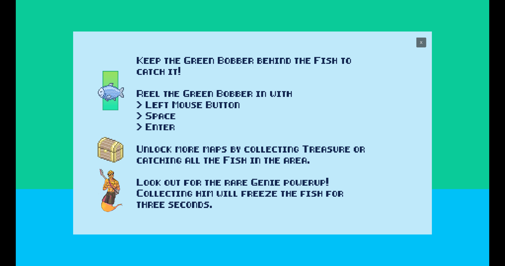

# 🎣Fishdew
For my first project using [Godot Engine](https://godotengine.org/), I've decided to create a game heavily based on the popular fishing mechanic from one of my favorite games: [Stardew Valley](https://www.stardewvalley.net/)!

The current version allows the player to fish in three different maps, each with new fish to catch. Each species varies in speed, ramping up the difficulty the more fish you discover! The next map can be unlocked by catching all the new fish species in the area, or by spending treasure that you collect as you fish.

## Screenshots

## Credits
Player, fish and treasure chest assets were made by my friend Joshua ([Instagram](https://www.instagram.com/englishrazor/), @englishrazor on Discord)
Genie asset was provided by a buddy Kaitlyn from [DevelUP](https://develup.games/)

Original game concept is by [ConcernedApe](https://twitter.com/ConcernedApe?ref_src=twsrc%5Egoogle%7Ctwcamp%5Eserp%7Ctwgr%5Eauthor), the creator of Stardew Valley
